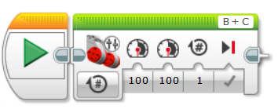
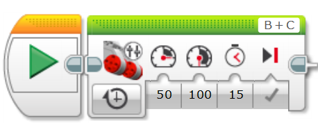
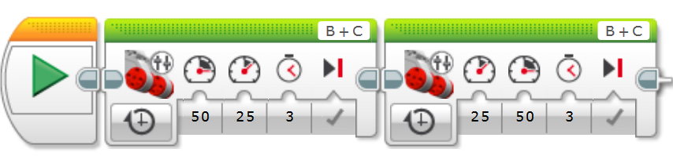
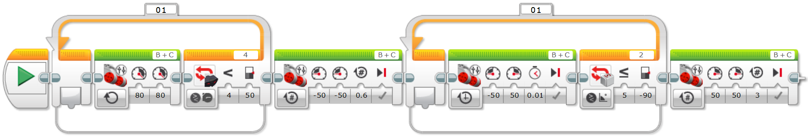
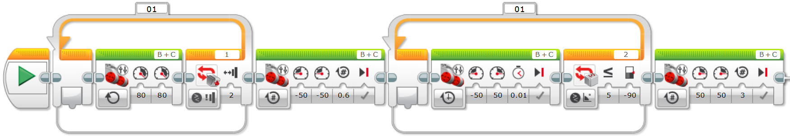

# Laboratorio 1

Jesús Manuel Aragón Buitrago

Juan Carlos González Ibarra

Ángel Rivera Amórtegui

Duvan Stiven Tique Osorio

## Punto 1: Movimiento en Línea Recta

## Punto 2: Movimiento con Curva

## Punto 3: Girosensor

## Punto 4: Sensor Infrarrojo

## Punto 5: Sensor de Contacto

## 5. Código en bloques

## 6. Videos de ejecución

[Sensor de Ultrasonido](videos/SensorUltrasonido.mp4)
[Movimiento y giro a 45°](videos/Giro45Grados.mp4)
[Movimiento en S](videos/MovimientoS.mp4)
